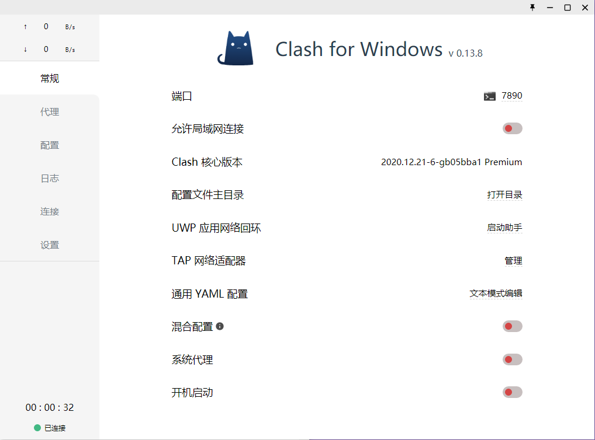
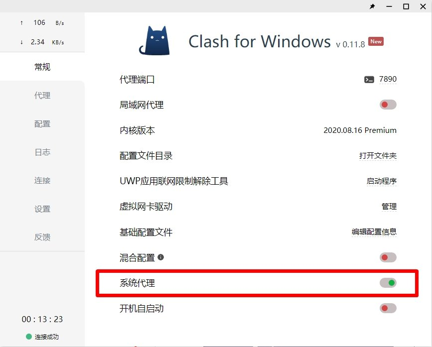
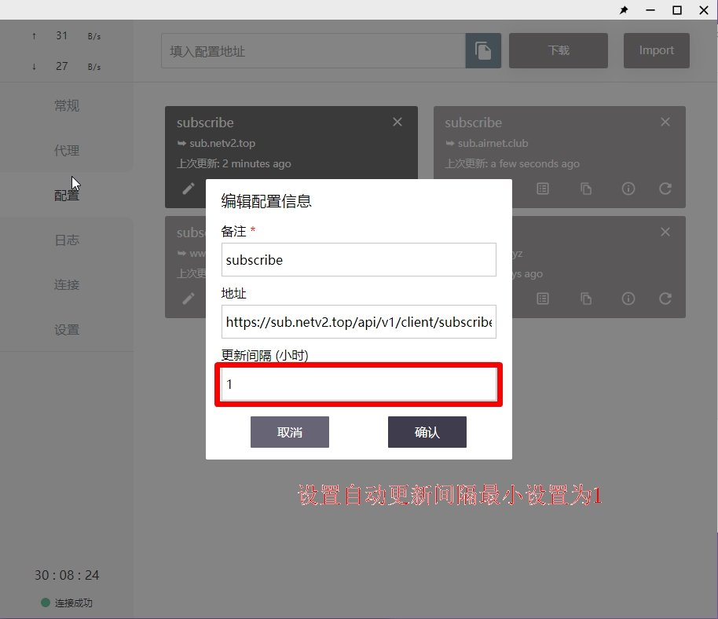
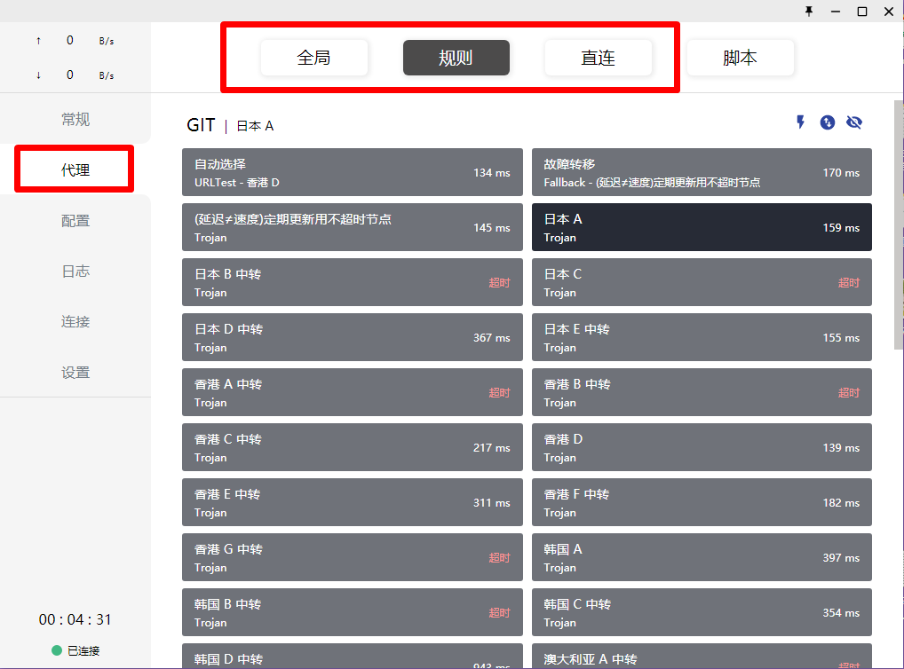

# Clash图文教程\[推荐使用\]

## 软件下载地址

#### 电脑系统应为Windows 7及以上（如果不知道自己电脑是64位还是32位，请下载64，如果不能用请下载32）

#### [64位电脑下载地址](https://pan.ututools.com/onedrive/01_%E8%BD%AF%E4%BB%B6/07_%E9%AD%94%E6%B3%95%E4%B8%8A%E7%BD%91/CLASH/Clash.for.Windows-0.13.8-64%E4%BD%8D-win.7z)

#### [32位电脑下载地址](https://pan.ututools.com/onedrive/01_%E8%BD%AF%E4%BB%B6/07_%E9%AD%94%E6%B3%95%E4%B8%8A%E7%BD%91/CLASH/Clash.for.Windows-0.13.7-32%E4%BD%8D-win.7z)

## Clash软件图文教程

### 1. 软件下载后请全部解压到磁盘内（建议D盘），如果没有解压软件，请提前安装解压软件（比如7z，好压，360压缩等）

### 2. 主界面展示（正常使用只操作【常规，代理，配置】，这三个选项即可）

### 

### 4. 把订阅复制到软件内，并显示出新的配置文件，右上角也会显示绿色的成功，然后鼠标点击一下新出现的配置文件，选中后会变成深色，未选中是浅色

### 5. 选好配置文件后，点侧边栏的代理，然后选择一个有数值的节点（此数值不是ping延迟）右上角的小闪电按钮可以测试节点的有效性，有数值的均可以使用

### **6. 最后点击侧边栏的常规，点击系统代理就可以启动软件了**

### 7. 连接后，可以打开[www.YouTube.com](https://youtube.com/)测试一下，如果油管可以打开就说明已经成功

### **8. 设置自动更新订阅（**自动更新的意思是会每隔多久会自动将最新的服务器同步到软件内**）**

#### **点击侧边栏的配置，选择配置文件的设置按钮（如图）**

#### 然后把更新间隔设置为1。（就是每隔一个小时自动更新订阅）

### 9. 如果需要选择模式，请点击侧边栏代理，最上方（如图）

> 规则：代表规则模式，属于国内直连，国外自动走节点流量（建议使用）
>
> 全局：代表全局模式，全部国内国外都走节点流量（有可能导致访问国内比较卡）
>
> 直连：代表直连模式，全部国内国外走不走节点流量（相当于没开clash）
>
> 脚本：配置比较复杂不建议用。

